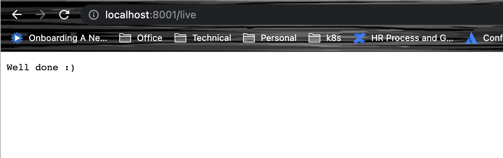
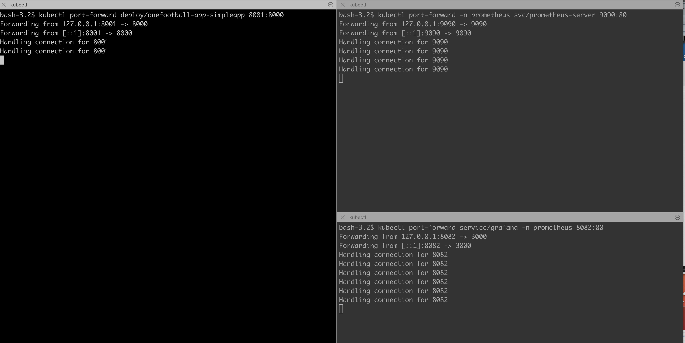
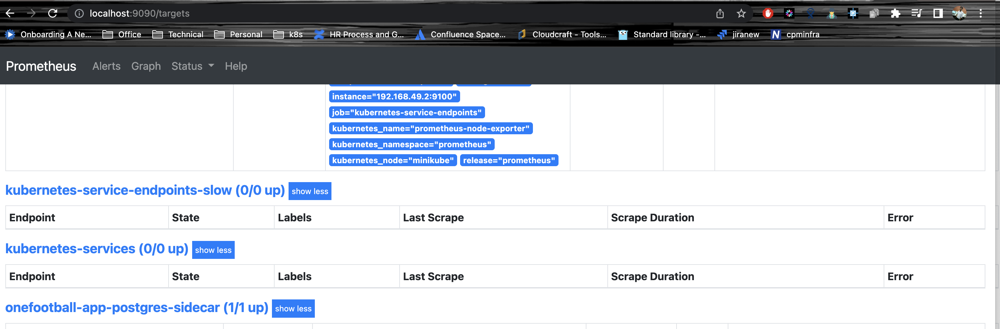
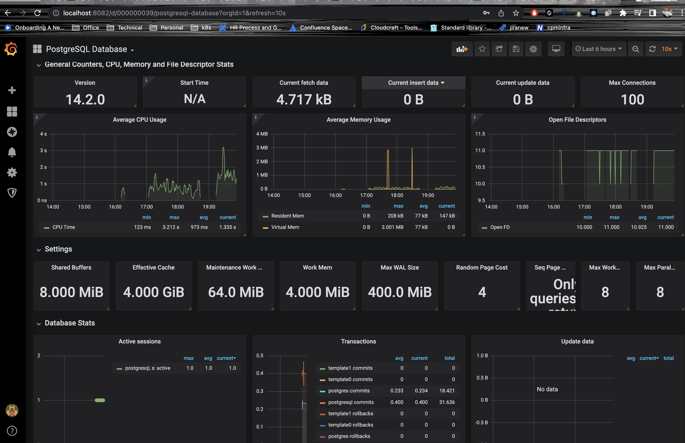

## Assignment Implementation

### Introduction
This is a `simple service` which exposed `live` api to ensure the service is up and running, connected to database succesfully.

### Dockerfile Creation:

To build and push docker image run the below 
```bash
cd SourceCode
docker build -t <repo-name> .

docker login <docker hub>
docker push <tagname>
```

### Service Deployment:
Start the minikube
```bash
minikube start 
```

Created helm chart by including the below

- K8s Deployment for simple service
- Created K8s Service with HPA enabled with CPU for scaling
- Created STS for Postgres DB
- Created Sidecar container for Postgress STS  exposing metrics to Prometheus
- Fixed the DB connectivity issue
- Deployed Prometheus and configured STS sidecar config.
- Deployed grafana to visualize the metrics in Dashboard

### Helm Installation steps for all charts:
```bash
cd HelmCharts
helm install onefootball-app simpleapp.tgz
helm install onefootball-db postgresql.tgz
helm install grafana -n prometheus grafana.tgz -f grafana_values.yaml
helm install prometheus -n prometheus prometheus.tgz -f prometheus-values.yaml
```

###  Access and Test the application:

We have to port forward the application 

```bash
kubectl port-forward deploy/onefootball-app-simpleapp 8001:8000
kubectl port-forward -n prometheus svc/prometheus-server 9090:80
kubectl port-forward service/grafana -n prometheus 8082:80
```

### Application status:


### Application Port forwarding:


### Prometheus dashboard:


### Grafana Dashboard:
